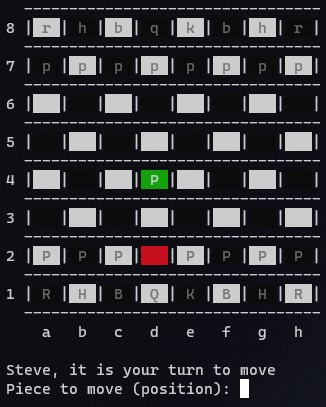
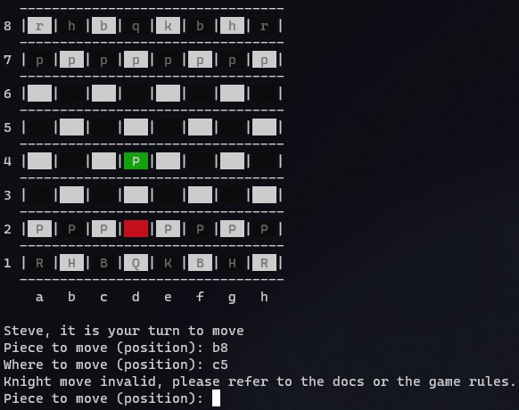
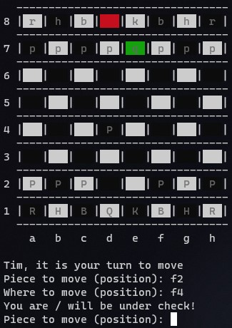

# Chess-for-Nerds
Play chess against your terminal buddy

### Samples
- Most recent move colored:

> 
- Error on invalid moves:

> 
- Identifies the 'CHECK' position:

> 

### How to Play

On your favorite terminal paste the following:
```
git clone https://github.com/DevPranjal/Chess-for-Nerds.git
cd Chess-for-Nerds/chess-PvP/
python play.py
```

### Rules

- General Rules can be found [here](https://en.wikipedia.org/wiki/Rules_of_chess)
- Specific rules are:
  - Enter position on the board to locate a square, eg. a1 or h4
  - Capital letter represent white, small letters represent black

### Features checklist:

- [x] Basic rules: Proper moving and capturing
- [x] Powers of Pieces
- [x] Identification of Check position
- [ ] Identification of Checkmate position
- [ ] Special moves: Castling, En Passant
- [ ] Players playing on different devices
